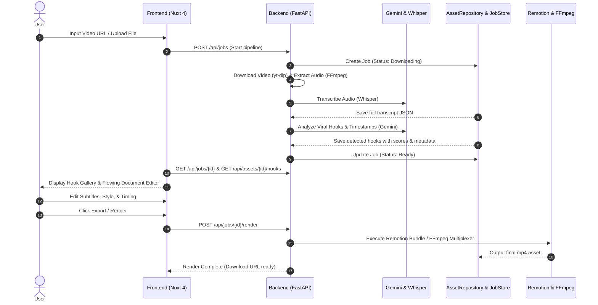

# Architecture Guidelines

## Overview
Guidelines for system topology, end-to-end video processing pipelines, module depth, boundaries, and persistent state in the **yonru.clip** codebase.

---

## 1. System Topology & Service Roles

The **yonru.clip** ecosystem operates as a 3-tier architecture coordinated by a unified root launcher ([`run.py`](../../run.py)):

```mermaid
graph TD
    User["User Browser"] -->|UI / Editor (Port 3000)| Frontend["Frontend (Nuxt 4 / Vue 3.5)"]
    Frontend -->|REST API / State Polling (Port 8000)| Backend["Backend (FastAPI / Python 3.12)"]
    Frontend -->|Iframe Realtime Preview (Port 3003)| RemotionPreview["Remotion Studio / Preview Engine"]
    Backend -->|Media Downloads| YouTube["yt-dlp / Cookies Session"]
    Backend -->|Transcription| Whisper["Whisper Audio Transcriber"]
    Backend -->|Hook Analysis| Gemini["Google Gemini GenAI Client"]
    Backend -->|Export & Rendering| RenderEngine["Render Engine (Remotion CLI / FFmpeg)"]
```

### Service Responsibilities:
1. **Frontend (`frontend/`, Port 3000)**:
   - Built with **Nuxt 4 (`app/` directory)**, **Vue 3.5+**, and **TailwindCSS**.
   - Handles the Cinematic Hook Gallery, Flowing Document Transcript Editor, Draggable Subtitle Customization Panel, and embedded Remotion live preview player.
2. **Backend (`backend/`, Port 8000)**:
   - Built with **FastAPI**, **Python 3.12+**, and **Pyright**.
   - Orchestrates video processing pipelines via `WorkflowCoordinator`, persists state via `JSONFileJobStore`, and isolates media storage via `AssetRepository`.
3. **Remotion Engine (`remotion_engine/`, Port 3003 / Headless CLI)**:
   - Built with **React**, **Remotion**, and **Vite**.
   - Provides frame-accurate real-time subtitle preview in the editor and headless video rendering compositions for final exports.

---

## 2. End-to-End Processing Pipeline

The video lifecycle follows a deterministic 5-phase pipeline:



---

## 3. Engineering Architecture Rules

### 1. Deep Modules and Clean Seams
- **Prioritize Depth**: Write modules that concentrate rich, complex behavior behind highly simplified, stable public interfaces. Do not build shallow pass-through controllers.
- **Locality of Change**: Bugs, state transformations, and subprocess executions must remain isolated inside their specific adapter domains. Never leak raw file systems, job-polling mutations, or platform-specific FFmpeg details across seams.
- **Double Adapters**: Define clear seams via abstract ports (e.g., `AssetStore` abstract class) with at least two adapters:
  1. A production adapter (`AssetRepository`) communicating with the disk/subprocesses.
  2. A highly performant mock adapter (`MockAssetStore`) for deterministic unit/integration testing.

### 2. Frontend Composable Modularity
- **Decoupled Composables**: Refactor monolithic frontend composables (e.g., state composables exceeding 1,000 lines) into highly decoupled, specialized domain sub-composables (e.g., timeline sequencing, system diagnostics, safety auditing).
- **Facade Mediator Pattern**: Parent state composables must act strictly as clean mediator facades, delegating domain operations and state refs directly to sub-composables rather than maintaining duplicate local logic or shallow wrapper helpers.
- **Decoupled Shared Reactivity**: Leverage matching global state keys (e.g., Nuxt's `useState<T>('key')`) across sub-composables to share reactive state seamlessly, preventing parameter drill-down and keeping domain boundaries high.

### 3. Persistent State Guidelines
- **Atomic Updates**: Because state stores (like `JSONFileJobStore`) use directory-based per-job file storage, always retrieve, mutate locally, and explicitly re-assign the job dictionary (`self.jobs[job_id] = job`) to trigger thread-safe, atomic per-file serialization. Mutating in-place nested dictionaries directly on store objects is forbidden.
