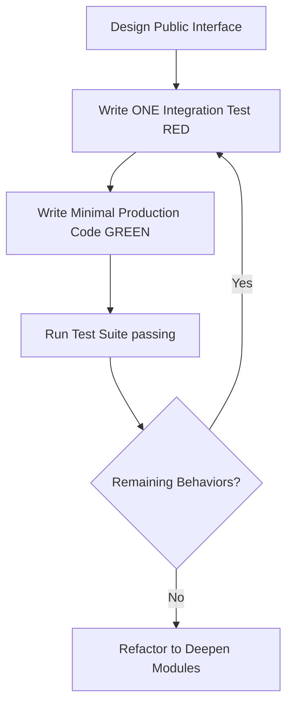

# Testing Guidelines

## Overview
Guidelines for Test-Driven Development (TDD), mocking, and frontend/backend testing in the **yonru.clip** codebase.

## Rules

### 1. Test-Driven Development Loop (`/tdd`)
All bug fixes, system integrations, and refactoring efforts must employ test-driven vertical slices:

### 2. Vertically Sliced Cycles
- **Vertical Slices Only**: Never write all test suites upfront (horizontal slicing). Write exactly one test asserting one behavior, implement minimal production code to pass it, and repeat.
- **Test Observable Behavior**: Tests must interface only through the public seam or API endpoints. Never assert private methods, database implementations, or raw disk files directly.
- **Zero-Flakiness Mocking**: Use concrete mock adapters (`MockAssetStore`) to run entire suites with zero actual file I/O or active network requests.

### 3. Frontend Testing
- **Colocation and Framework**: For frontend TDD cycles, write colocated `*.spec.ts` files inside the `frontend/tests/` folder (organized by mirroring the app folder structure, e.g., `tests/components/` or `tests/pages/`), leveraging Vitest, Happy DOM, and `@nuxt/test-utils`.
