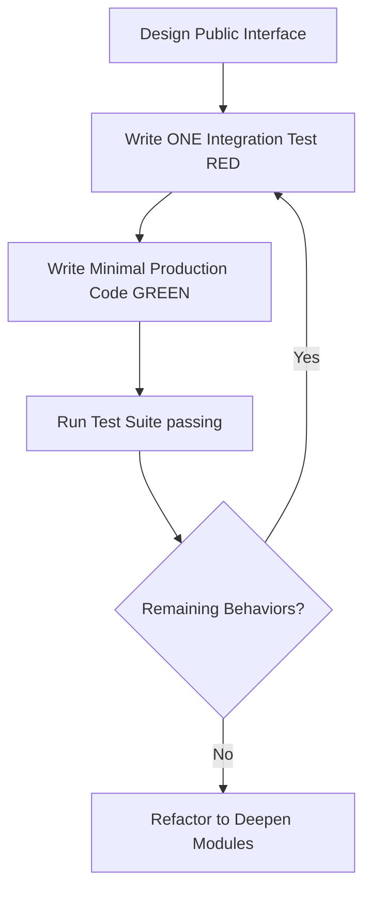

# Developer Agent Coordination Guidelines (AGENTS.md)

This document formalizes the development guidelines, testing loops, and architectural rules for agentic assistants working on the **yonru.clip** codebase.

---

## 1. Core Architectural Strategy (`/improve-codebase-architecture`)

All functional enhancements must follow the principles of **deep modules** and **clean seams**:

*   **Prioritize Depth**: Write modules that concentrate rich, complex behavior behind highly simplified, stable public interfaces. Do not build shallow pass-through controllers.
*   **Locality of Change**: bugs, state transformations, and subprocess executions must remain isolated inside their specific adapter domains. Never leak raw file systems, job-polling mutations, or platform-specific FFmpeg details across seams.
*   **Double Adapters**: Define clear seams via abstract ports (e.g., `AssetStore` abstract class) with at least two adapters:
    1.  A production adapter (`AssetRepository`) communicating with the disk/subprocesses.
    2.  A highly performant mock adapter (`MockAssetStore`) for deterministic unit/integration testing.

---

## 2. Test-Driven Development Loop (`/tdd`)

All bug fixes, system integrations, and refactoring efforts must employ test-driven vertical slices:

### Vertically Sliced Cycles
*   **vertical slices only**: Never write all test suites upfront (horizontal slicing). Write exactly one test asserting one behavior, implement minimal production code to pass it, and repeat.
*   **Test Observable Behavior**: Tests must interface only through the public seam or API endpoints. Never assert private methods, database implementations, or raw disk files directly.
*   **Zero-Flakiness Mocking**: Use concrete mock adapters (`MockAssetStore`) to run entire suites with zero actual file I/O or active network requests.

---

## 3. Persistent State Guidelines
*   **Atomic Updates**: Because state stores (like `JSONFileJobStore`) read eagerly from disk to maintain freshness, always retrieve, mutate locally, and explicitly re-assign the job dictionary (`self.jobs[job_id] = job`) to trigger thread-safe, atomic serialization. Mutating in-place nested dictionaries directly on store objects is forbidden.

---

## 4. Self-Healing & Isolated Environments
*   **Self-Healing Bootstraps**: Always rely on the built-in system coordinator (`run.py`) to manage dependencies, provison virtual environments (`backend/venv`), and synchronize offline fonts. Avoid manually installing pip or npm packages globally.
*   **Environment Isolation**: Never run system global commands when verifying code. Always use virtualenv binary paths directly (e.g. `backend/venv/bin/pytest` or `backend/venv/bin/python`).

---

## 5. Security Constraints & Boundaries
*   **Absolute Path Validation**: When implementing deletions on disk, always resolve absolute paths and validate against a base folder using `os.path.commonpath` to actively block directory traversal vulnerabilities.
*   **Command Sanitization**: Always escape or structure shell arguments securely to block command injection when spawning external FFmpeg or Node subprocesses.

---

## 6. Token Optimization & Git Conventions
*   **Token Compression (`rtk`)**: Always prefix shell command executions with `rtk` to filter and compress output logs, conserving system token space.
*   **Conventional Commits**: Every commit must use an active, plain-language Conventional Commit prefix (e.g., `fix:`, `feat:`, `refactor:`, `test:`).
*   **Simple Verbose Logs**: Do not use jargon (e.g., 'decommission', 'ameliorate'). Prefer clear, active verbs (e.g., 'remove', 'fix', 'use').
*   **Explicit Approval**: Always prompt the user and obtain explicit permission before staging, committing, or pushing code.
